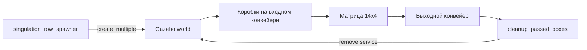

# Архитектура проекта

## Основной поток управления

```mermaid
flowchart LR
    A[Алгоритм сингуляризации] -->|MatrixCommand| B[/singulator/matrix/command]
    B --> C[matrix_command_fanout]
    C --> D[56 ROS-топиков Float64]
    D --> E[ros_gz_bridge]
    E --> F[56 Gazebo TrackController]
    F --> G[Физика коробок в Gazebo]
```

`matrix_command_fanout` является границей между алгоритмом и симулятором. Внешний алгоритм знает только размер матрицы и массив скоростей. Имена SDF-моделей, Gazebo Transport и устройство bridge остаются внутри цифрового двойника.

## Поток сценария



Спавнер работает по `/clock`, то есть по времени симуляции. При снижении Real Time Factor поток замедляется вместе с Gazebo и не пытается поддерживать частоту по системному времени компьютера.

## Пакеты

### `singulator_interfaces`

Стабильные сообщения между независимыми частями проекта:

- `BoxObservation`;
- `BoxObservationArray`;
- `MatrixCommand`;
- `MatrixState`;
- `ResetScenario`.

Изменение этих типов считается изменением контракта и должно согласовываться со вторым программистом.

### `singulator_description`

Хранит конфигурацию матрицы и модели. Файл `config/matrix.yaml` описывает текущую геометрию симуляции.

### `singulator_gazebo`

Хранит SDF-миры. Основной рабочий мир:

```text
worlds/matrix_14x4_stream.sdf
```

Мир включает 56 ячеек, входной и выходной конвейеры. У каждой поверхности отдельный `TrackController`.

`generate_matrix_14x4_stream.py` является генератором основного SDF. При изменении геометрии необходимо менять генератор, повторно создавать мир и запускать статическую проверку.

### `singulator_bringup`

Основной launch-файл:

```text
launch/matrix_stream.launch.py
```

Он запускает:

1. Gazebo;
2. четыре bridge-процесса для строк матрицы;
3. отдельный bridge для `/clock`, входного и выходного конвейеров;
4. `matrix_command_fanout`;
5. контроллер входного и выходного конвейеров;
6. опционально спавнер, тестовый контроллер и очистку.

Bridge разбит на несколько процессов, чтобы один процесс не обслуживал сразу все 58 приводов.

### `singulator_sim`

- `matrix_command_fanout.py` — перевод общей команды в 56 команд;
- `singulation_row_spawner.py` — создание волн коробок;
- `box_model.py` — размеры, масса, инерция и SDF коробок;
- `cleanup_passed_boxes.py` — удаление прошедших и упавших коробок.

### `singulator_control`

- `aux_conveyor_controller.py` — поддерживает скорости входного и выходного конвейеров;
- `uniform_matrix_controller.py` — одинаковая скорость всех ячеек;
- `matrix_test_controller.py` — тестовые профили вращения;
- `row_1x4_controller.py` — тест одного поперечного ряда;
- `single_cell_commander.py` — тест одной ячейки.

## Что является источником истины

Для текущей симуляции приоритет такой:

1. `matrix_14x4_stream.sdf` — фактическая физическая модель;
2. `generate_matrix_14x4_stream.py` — код генерации модели;
3. `matrix.yaml` — краткая конфигурация для других модулей;
4. документация.

Если значения расходятся, сначала проверяется SDF и генератор, затем обновляются конфигурация и документация.

## Нереализованные блоки

В схеме будущей системы предусмотрены:

```mermaid
flowchart LR
    V[Камера или ground truth] --> B[/singulator/boxes]
    B --> A[Алгоритм сингуляризации]
    A --> M[/singulator/matrix/command]
```

Тип `/singulator/boxes` уже определён, но в текущем репозитории нет рабочего узла, регулярно публикующего наблюдения из Gazebo. Поэтому алгоритм пока должен получать тестовые данные отдельно или работать по заранее заданному сценарию.
