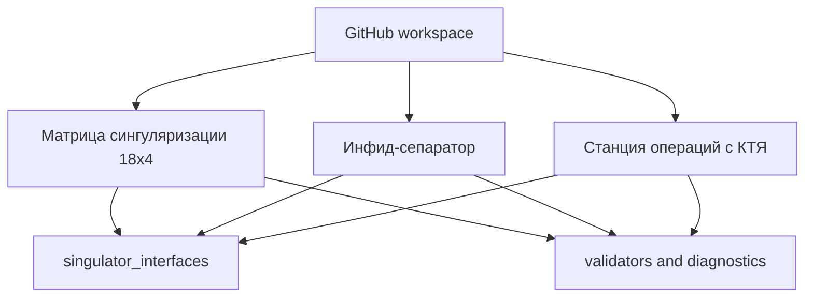
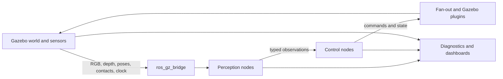
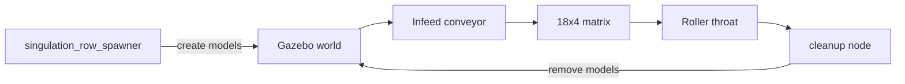
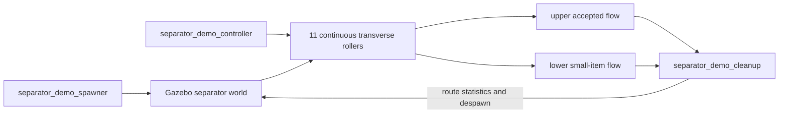
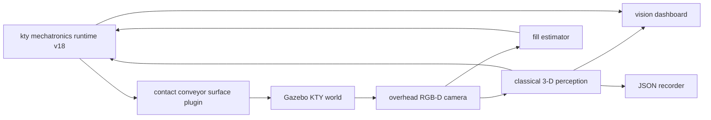
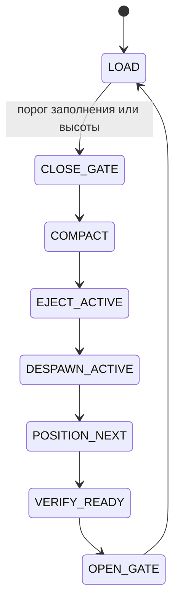

# Архитектура проекта

## Общая структура

Репозиторий содержит три независимых цифровых стенда, использующих общие ROS 2-интерфейсы, единый workspace и общий набор средств диагностики.

```mermaid
flowchart TB
    R[GitHub workspace]
    R --> M[Матрица сингуляризации 18x4]
    R --> S[Инфид-сепаратор]
    R --> K[Станция операций с КТЯ]

    M --> I[singulator_interfaces]
    S --> I
    K --> I

    M --> V[validators and diagnostics]
    S --> V
    K --> V
```

Стенды запускаются отдельно. Это уменьшает вычислительную нагрузку и позволяет экспертам независимо проверить физику, алгоритмы управления и машинное зрение каждого узла.

## Сквозная схема взаимодействия

```mermaid
flowchart LR
    G[Gazebo world and sensors]
    B[ros_gz_bridge]
    P[Perception nodes]
    C[Control nodes]
    F[Fan-out and Gazebo plugins]
    D[Diagnostics and dashboards]

    G -->|RGB, depth, poses, contacts, clock| B
    B --> P
    P -->|typed observations| C
    C -->|commands and state| F
    F --> G
    P --> D
    C --> D
    G --> D
```

## Матрица сингуляризации

### Контур машинного зрения и управления

```mermaid
flowchart LR
    CAM[Gazebo camera]
    CV[singulator_perception]
    OBS[/singulator/boxes]
    CTRL[singulation_controller]
    CMD[/singulator/matrix/command]
    FAN[matrix_command_fanout]
    CELL[72 individual speed topics]
    BR[ros_gz_bridge]
    PHY[72 driven matrix cells]

    CAM --> CV
    CV --> OBS
    OBS --> CTRL
    CTRL --> CMD
    CMD --> FAN
    FAN --> CELL
    CELL --> BR
    BR --> PHY
```

Контроллер не назначает скорость каждой ячейке независимо. Он сначала формирует глобальный порядок товаров, рассчитывает требования к скоростям соседних товаров, затем решает задачу распределения команд по пересекаемым ячейкам с учётом площади контакта. Подробности приведены в `SINGULATION_CONTROL.md`.

### Актуальная размерность

- 18 продольных рядов;
- 4 поперечные колонки;
- 72 независимо управляемые зоны;
- строки `r00...r17`;
- колонки `c00...c03`;
- массив команд индексируется как `row * 4 + col`.

### Поток сценария

```mermaid
flowchart LR
    SPAWN[singulation_row_spawner]
    WORLD[Gazebo world]
    IN[Infeed conveyor]
    MATRIX[18x4 matrix]
    THROAT[Roller throat]
    CLEAN[cleanup node]

    SPAWN -->|create models| WORLD
    WORLD --> IN
    IN --> MATRIX
    MATRIX --> THROAT
    THROAT --> CLEAN
    CLEAN -->|remove models| WORLD
```

Спавнер использует симуляционное время и фиксированный seed для воспроизводимости.

## Инфид-сепаратор

```mermaid
flowchart LR
    SP[separator_demo_spawner]
    IW[Gazebo separator world]
    IC[separator_demo_controller]
    SCREEN[11 continuous transverse rollers]
    UP[upper accepted flow]
    LOW[lower small-item flow]
    MON[separator_demo_cleanup]

    SP --> IW
    IC --> SCREEN
    IW --> SCREEN
    SCREEN --> UP
    SCREEN --> LOW
    UP --> MON
    LOW --> MON
    MON -->|route statistics and despawn| IW
```

Роликовый экран состоит из 11 сплошных поперечных валов длиной 2,480 м. Межосевой шаг равен 130 мм, диаметр ролика — 50 мм, поэтому чистое продольное отверстие составляет 80 мм.

Классификация выполняется по продольной опорной проекции `projection_x`. Товары с `projection_x < 70 мм` ожидаются на нижней ветви, а безопасный верхний класс начинается с `projection_x >= 90 мм`. Физическое отверстие 80 мм находится посередине защитного диапазона и даёт по 10 мм запаса относительно обоих классов. Фактический маршрут определяется по потоку поз Gazebo и сравнивается с ожидаемым.

## Станция операций с КТЯ

### Принятый runtime

```mermaid
flowchart LR
    MC[kty mechatronics runtime v18]
    SURF[contact conveyor surface plugin]
    WORLD[Gazebo KTY world]
    RGBD[overhead RGB-D camera]
    PER[classical 3-D perception]
    FILL[fill estimator]
    DASH[vision dashboard]
    REC[JSON recorder]

    MC --> SURF
    SURF --> WORLD
    WORLD --> RGBD
    RGBD --> PER
    RGBD --> FILL
    PER --> MC
    FILL --> MC
    PER --> DASH
    PER --> REC
    MC --> DASH
```

Ground truth и реестр поз используются для контроля жизненного цикла, safety-проверок и диагностики. Они не подаются на вход классического алгоритма сегментации товаров.

### Рабочий цикл

```mermaid
stateDiagram-v2
    [*] --> LOAD
    LOAD --> CLOSE_GATE: порог заполнения или высоты
    CLOSE_GATE --> COMPACT
    COMPACT --> EJECT_ACTIVE
    EJECT_ACTIVE --> DESPAWN_ACTIVE
    DESPAWN_ACTIVE --> POSITION_NEXT
    POSITION_NEXT --> VERIFY_READY
    VERIFY_READY --> OPEN_GATE
    OPEN_GATE --> LOAD
```

В мире одновременно могут находиться активный и ожидающий КТЯ. Ожидающая тара предварительно подаётся во время отвода заполненной, а старая тара удаляется до финального позиционирования новой.

## Пакеты

| Пакет | Ответственность |
|---|---|
| `singulator_interfaces` | Пользовательские сообщения и межмодульные контракты |
| `singulator_description` | Геометрия, модели и конфигурации |
| `singulator_gazebo` | SDF-миры и генераторы геометрии |
| `singulator_bringup` | Launch-файлы и конфигурации мостов |
| `singulator_sim` | Спавнеры, fan-out, очистка и сценарные узлы |
| `singulator_control` | Контроллер сингуляризации и вспомогательные приводы |
| `singulator_perception` | Машинное зрение матрицы |
| `kty_conveyor_surface` | Gazebo-плагин контактных транспортных поверхностей |
| `kty_station_sim` | Механика КТЯ, RGB-D, уплотнение, dashboard и диагностика |

## Границы достоверности

- контактная динамика и коллизии моделируются Gazebo;
- деформация картона, резины и упаковки не моделируется;
- параметры трения являются калибровочными: для матрицы приняты `mu=0,8`, `mu2=0,2`;
- моторы представлены управляемыми скоростями и ограничениями, а не полной электрической моделью;
- одна верхняя RGB-D камера имеет физические ограничения при полной окклюзии и отсутствии видимого шва;
- внешняя WMS заменена демонстрационным контуром назначения маршрута.

## Источники истины

При расхождении документации и реализации используется следующий приоритет:

1. активный launch-файл;
2. SDF-мир и генератор SDF;
3. конфигурационные YAML-файлы;
4. код контроллера и perception-узлов;
5. валидаторы;
6. документация.

Перед релизом документация и валидаторы должны быть синхронизированы с первыми четырьмя уровнями.
