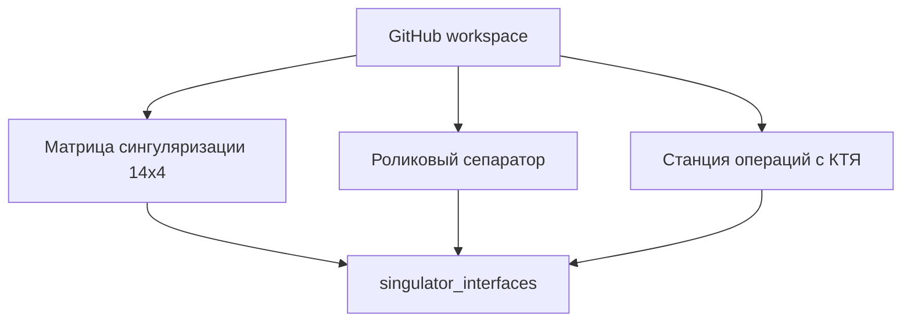
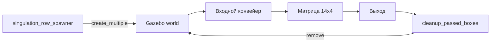
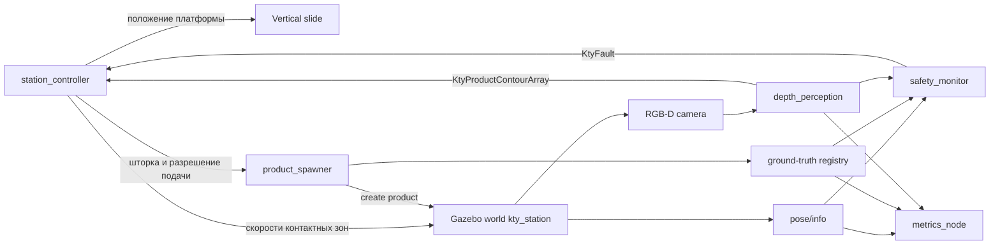
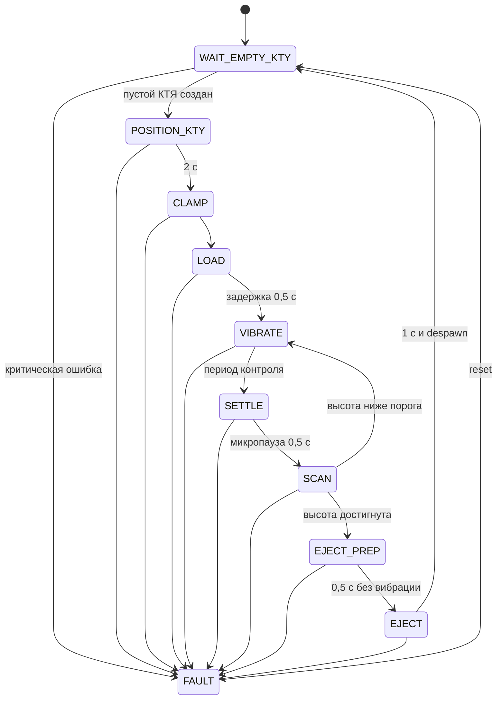

# Архитектура проекта

## Общая структура

Репозиторий содержит несколько независимых цифровых стендов, использующих общие ROS 2 интерфейсы и единый подход к запуску:

```mermaid
flowchart TB
    R[GitHub workspace]
    R --> M[Матрица сингуляризации 14x4]
    R --> S[Роликовый сепаратор]
    R --> K[Станция операций с КТЯ]

    M --> MI[singulator_interfaces]
    S --> MI
    K --> MI
```

Стенды запускаются отдельно и не должны одновременно использовать одинаковые имена миров или конфликтующие топики.

## Матрица сингуляризации

### Поток управления

```mermaid
flowchart LR
    A[Алгоритм сингуляризации] -->|MatrixCommand| B[/singulator/matrix/command]
    B --> C[matrix_command_fanout]
    C --> D[56 ROS-топиков Float64]
    D --> E[ros_gz_bridge]
    E --> F[56 Gazebo TrackController]
    F --> G[Физика товаров]
```

`matrix_command_fanout` является границей между алгоритмом и физической моделью. Внешний алгоритм знает только размер матрицы и построчный массив скоростей.

### Поток сценария

```mermaid
flowchart LR
    S[singulation_row_spawner] -->|create_multiple| W[Gazebo world]
    W --> I[Входной конвейер]
    I --> M[Матрица 14x4]
    M --> O[Выход]
    O --> C[cleanup_passed_boxes]
    C -->|remove| W
```

Спавнер использует `/clock`, поэтому интенсивность определяется симуляционным временем.

## Станция операций с КТЯ

### Функциональная схема

```mermaid
flowchart LR
    C[station_controller] -->|скорости контактных зон| G[Gazebo world kty_station]
    C -->|положение платформы| V[Vertical slide]
    C -->|шторка и разрешение подачи| P[product_spawner]
    P -->|create product| G
    G --> RGBD[RGB-D camera]
    RGBD --> D[depth_perception]
    D -->|KtyProductContourArray| C
    G --> GT[pose/info]
    P --> REG[ground-truth registry]
    GT --> SAFE[safety_monitor]
    REG --> SAFE
    D --> SAFE
    SAFE -->|KtyFault| C
    GT --> MET[metrics_node]
    REG --> MET
    D --> MET
```

### Автомат состояний

```mermaid
stateDiagram-v2
    [*] --> WAIT_EMPTY_KTY
    WAIT_EMPTY_KTY --> POSITION_KTY: пустой КТЯ создан
    POSITION_KTY --> CLAMP: 2 с
    CLAMP --> LOAD
    LOAD --> VIBRATE: задержка 0,5 с
    VIBRATE --> SETTLE: период контроля
    SETTLE --> SCAN: микропауза 0,5 с
    SCAN --> VIBRATE: высота ниже порога
    SCAN --> EJECT_PREP: высота достигнута
    EJECT_PREP --> EJECT: 0,5 с без вибрации
    EJECT --> WAIT_EMPTY_KTY: 1 с и despawn
    WAIT_EMPTY_KTY --> FAULT: критическая ошибка
    POSITION_KTY --> FAULT
    CLAMP --> FAULT
    LOAD --> FAULT
    VIBRATE --> FAULT
    SETTLE --> FAULT
    SCAN --> FAULT
    EJECT_PREP --> FAULT
    EJECT --> FAULT
    FAULT --> WAIT_EMPTY_KTY: reset
```

### Граница физической достоверности

- КТЯ — открытая тонкостенная сборка из пяти жёстких коллизионных тел.
- Рольганги и выталкивание заменены контактными поверхностями с заданной скоростью.
- Виброплатформа перемещается по вертикальному призматическому соединению.
- Четыре пружины пока являются визуальными объектами.
- Деформация картона и полиуретана не моделируется.
- Ground truth не подаётся в алгоритм зрения и используется только для контроля и метрик.

## Пакеты

### `singulator_interfaces`

Общие контракты:

- матрица: `BoxObservation`, `BoxObservationArray`, `MatrixCommand`, `MatrixState`, `ResetScenario`;
- КТЯ: `KtyProductContour`, `KtyProductContourArray`, `KtyGroundTruth`, `KtyGroundTruthArray`, `KtyStationState`, `KtyFault`.

Изменение этих сообщений является изменением межмодульного контракта.

### `singulator_description`

Конфигурация и модели матрицы, включая `config/matrix.yaml` и модель камеры.

### `singulator_gazebo`

SDF-миры матрицы и роликового сепаратора, а также генераторы геометрии.

### `singulator_bringup`

Launch-файлы, bridge-конфигурации и композиция основного стенда.

### `singulator_sim`

Спавнеры товаров, fan-out команд, очистка мира и сценарные адаптеры.

### `singulator_control`

Контроллеры вспомогательных конвейеров и алгоритмы управления матрицей.

### `singulator_perception`

Потоковая обработка камеры матрицы и сопровождение наблюдений.

### `kty_station_sim`

Самодостаточный модуль станции КТЯ:

- `worlds/kty_station.sdf` — упрощённая механика;
- `station_controller.py` — автомат и вибрация;
- `product_spawner.py` — хаотический поток 1 ед/с;
- `depth_perception.py` — RGB-D контуры и tracking;
- `safety_monitor.py` — аварийные условия;
- `metrics_node.py` — заполнение, пустоты, успокоение и точность зрения;
- `model_factory.py` — SDF КТЯ и товаров.

## Источники истины

Для матрицы:

1. фактический SDF мира;
2. генератор SDF;
3. YAML-конфигурация;
4. документация.

Для станции КТЯ:

1. `src/kty_station_sim/worlds/kty_station.sdf`;
2. `src/kty_station_sim/config/station.yaml`;
3. код `station_controller.py` и `model_factory.py`;
4. `docs/KTY_STATION.md`.

При расхождении сначала исправляется физическая модель и конфигурация, затем документация.
