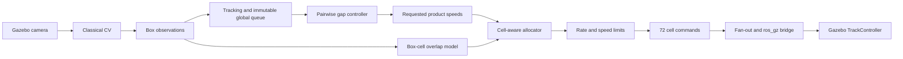

# Управление матрицей сингуляризации

## Назначение

Контроллер преобразует наблюдения машинного зрения в индивидуальные команды скорости для 72 ячеек матрицы 18×4. Основная цель — сформировать устойчивый продольный порядок и требуемые интервалы перед роликовым горлышком, не допуская реверса потока и резких команд.

## Входные данные

Для каждого товара perception-контур формирует:

- постоянный логический ID;
- координаты центра;
- продольный и поперечный размеры;
- yaw;
- оценку продольной скорости;
- confidence и timestamp.

Контроллер не определяет размеры товара повторно и не использует нейросетевую модель.

## Контур управления



## 1. Глобальная очередь

Товары сортируются по продольной координате. Уже подтверждённый порядок не перестраивается из-за кратковременных слияний масок или пропуска кадра. Для повторной идентификации используются геометрические ограничения по продольному и поперечному смещению.

## 2. Управление зазором

Для каждой соседней пары вычисляется:

```text
gap_error = target_gap - measured_gap
```

Положительная ошибка означает, что товары расположены слишком близко. Контроллер формирует требуемую разность скоростей между лидером и следующим товаром. Команда ограничивается допустимой относительной скоростью и общим диапазоном приводов.

Текущие основные параметры:

| Параметр | Значение |
|---|---:|
| `target_gap_m` | 0.18 м |
| `inter_wave_target_gap_m` | 0.28 м |
| `gap_gain` | 3.0 |
| `relative_velocity_gain` | 0.5 |
| `maximum_relative_speed_mps` | 2.0 м/с |
| `minimum_speed_mps` | 1.0 м/с |
| `maximum_speed_mps` | 3.0 м/с |
| `maximum_acceleration_mps2` | 6.0 м/с² |
| `publish_rate_hz` | 30 Гц |

## 3. Deadline recovery

Ближе к выходу доступное время уменьшается. Если пара ещё не достигла требуемого интервала, контроллер рассчитывает минимальную разность скоростей, необходимую для восстановления зазора до выхода. Этот запрос добавляется в pairwise-профиль, но по-прежнему ограничивается диапазоном скорости и ускорения.

## 4. Пересечение товара с ячейками

Ориентированный прямоугольник товара пересекается с прямоугольниками матрицы. Для каждой ячейки формируется вес, пропорциональный площади контакта. Эффективная скорость товара определяется как нормированная сумма скоростей ячеек под ним.

```text
v_effective(item) = Σ overlap(item, cell) · v_cell / Σ overlap(item, cell)
```

## 5. Разделяемые ячейки

Одна ячейка может одновременно поддерживать несколько товаров. Простое усреднение их требований создаёт большую ошибку и дрожание команд. Поэтому используется ограниченный coordinate-descent allocator:

1. каждому товару назначается целевая эффективная скорость;
2. строится матрица overlap-весов;
3. скорости ячеек итерационно изменяются для минимизации суммарной квадратичной ошибки;
4. срочные пары получают больший вес;
5. слабая regularization возвращает свободные ячейки к idle-speed;
6. результат ограничивается диапазоном приводов.

## 6. Коррекция yaw

Если товар опирается на несколько поперечных ячеек, разность их скоростей создаёт момент относительно вертикальной оси. Контроллер формирует небольшой дифференциальный компонент. В плотном кластере yaw-коррекция подавляется, потому что продольное разделение важнее вращения и снижает риск бокового столкновения.

## 7. Fail-safe поведение

При устаревших или низкоуверенных наблюдениях контроллер не генерирует неограниченную коррекцию. Команды остаются в допустимом диапазоне, свободные зоны переходят к idle-speed, а неуправляемые пары отражаются в диагностике.

## Проверка

```bash
python3 tools/test_v7_logic.py
bash ./scripts/check_v7_control.sh
```

Ожидается массив из 72 команд и отсутствие значений вне разрешённого диапазона.
