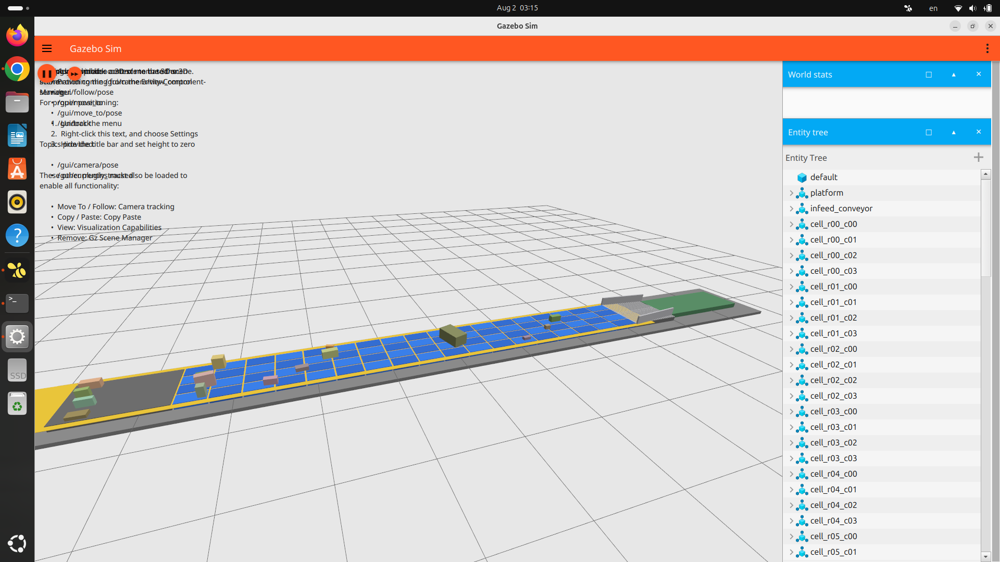
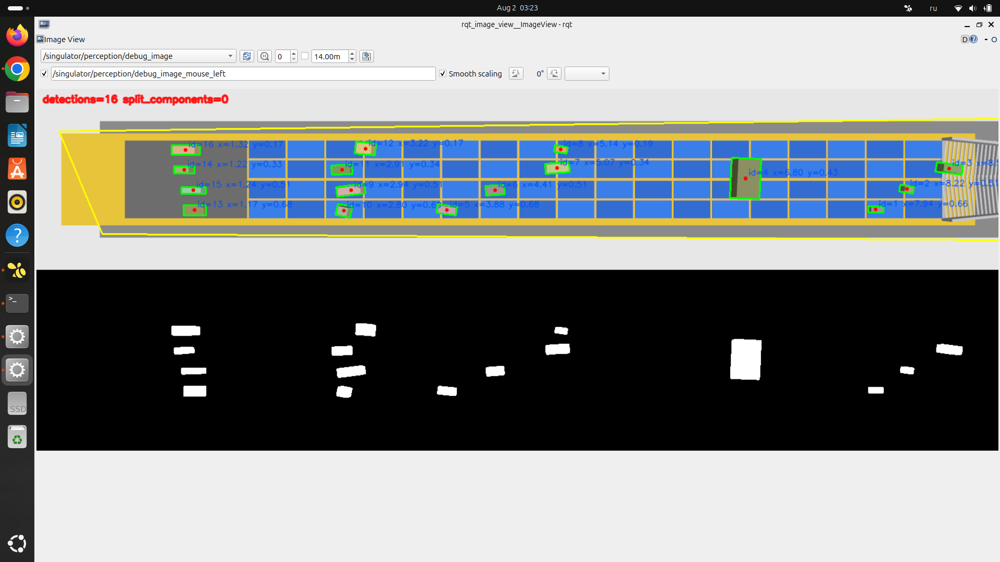
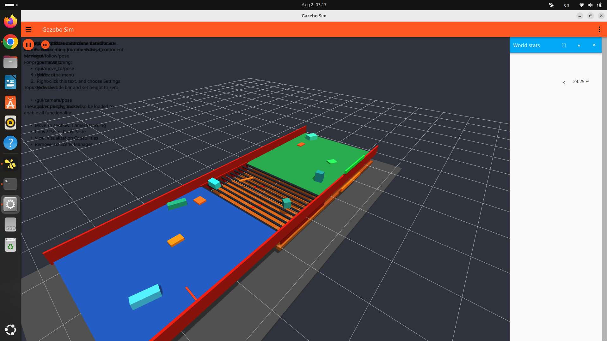
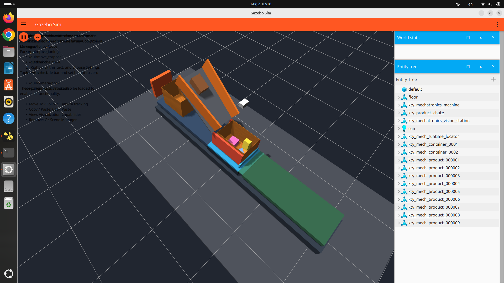
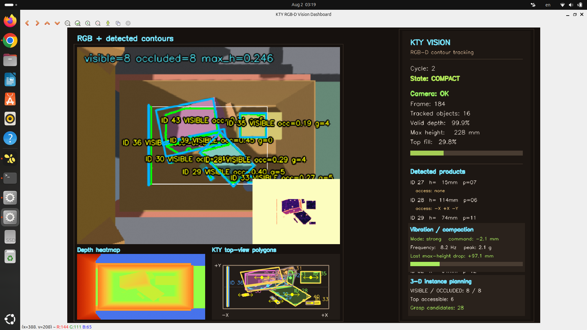

# Галерея Digital Twin Convey

Скриншоты получены на целевой машине с Ubuntu 24.04, ROS 2 Jazzy и Gazebo Harmonic. Все изображения сохранены в разрешении 1920×1080 и используются как визуальные подтверждения принятых runtime-сценариев.

## Матрица сингуляризации 18×4

Общий вид инфида, 72 независимо управляемых зон, роликового горлышка и выходного конвейера.

[](matrix_18x4_overview.png)

## GUI машинного зрения матрицы

Отладочный поток `/singulator/perception/debug_image`: контуры, ID и координаты товаров, а также бинарная маска сегментации.

[](singulation_vision_gui.png)

## Полноширинный инфид-сепаратор

Разделение товаров на верхнюю и нижнюю ветви через ряд сплошных поперечных роликов.

[](infeed_separator.png)

## Станция операций с КТЯ

Общий вид наклонного лотка, сходящихся направляющих, активного КТЯ, очереди тары и выходной транспортной зоны.

[](kty_station_scene.png)

## RGB-D dashboard станции КТЯ

Операторский интерфейс с RGB-разметкой, depth heatmap, видом сверху, состоянием цикла, оценкой заполнения и кандидатами захвата.

[](kty_rgbd_dashboard.png)

## Быстрый запуск интерфейсов

GUI зрения матрицы:

```bash
ros2 run rqt_image_view rqt_image_view \
  /singulator/perception/debug_image
```

RGB-D dashboard КТЯ:

```bash
ros2 run kty_station_sim vision_dashboard_3d \
  --ros-args \
  -r __node:=kty_vision_dashboard_window \
  -p show_window:=true \
  -p refresh_hz:=3.0
```

[Вернуться в корневой README](../../README.md).
